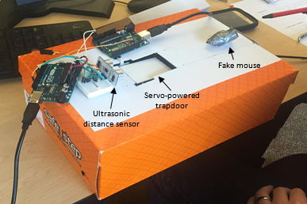

# Arduino Mouse Trap
###### Official CIS126 (Computer Architecture & Organization) Final Project by [Shane Staret](https://github.com/SStaret43), [Trush Patel](https://github.com/trushpatel1997), and [Chris Miller](https://github.com/chrism186). This project was created through the use of Arduino and Assembly (using Microsoft Visual Studio and the AVR Assembler).
###### This is a link to [my YouTube channel](https://www.youtube.com/channel/UCmQA16swmtPa29pRo9YtRTA?view_as=subscriber), featuring videos of this project on it. Here is a [video of the prototype in action](https://www.youtube.com/watch?v=mKeBMHQoORo) (without the hallway so you can actually see what's going on)
###### This is a link to the [Slack workspace](https://cis126.slack.com/) we used to communicate throughout this project. Click [here](https://join.slack.com/t/cis126/shared_invite/enQtMzU2OTYwMTgxMjUzLTQwMGU0OGM1ODQ2YTg3YmNjYTE4YzJhMWVmMTQ0MTE4M2Q4ZmMxZDFlNGI0YTQ1NTBhYjJmODYxOTc2MDY4ZmU) to join it and view what we said and did!
###### *We'd like to thank [Professor Robert Moyer](http://faculty.mc3.edu/rmoyer/) for helping us throughout this project.*
________________________________________________________________________________________________________________________________

## **Explanation & Design Process**

#### Our mouse trap does exactly what you would expect it to. The way it works is that there is a ramp leading up to a small hallway with bait within it. Behind this bait is a distance sensor, which we use to detect how close the mouse is to our bait. Cleverly, we placed a trapdoor directly in front of the bait, so once the sensor notices the mouse is over the trapdoor, it quickly opens and then closes. This causes the mouse to fall below into a small and *safe* area where they can be held until released.

#### A servo connected to our first Arduino is used to open and close the trapdoor. This Arduino is also responsible for relaying what kind of bait was used to trap the mouse to the second Arduino. The second Arduino keeps track of how many times a particular bait (either peanut butter, beef jerky, or cheese) was effective in trapping a mouse. Once the area the caught mice are held in is full (about after five mice), the second Arduino lights up an LED indicating to the user of the mouse trap that the contraption is full and that the mice need to be released.

#### The vast majority of our code was created within the Arduino IDE, using C and C++. The code in the Arduino IDE allowed us to connect the two Arduinos together and stored all variables that we needed. The Arduino code also controlled the movement of the servo and the lighting up of the LED. Some of our code was created in Assembly using the AVR Assembler. We created a Lookup table within assembly with data spaces that kept track of how many times a mouse was caught using a specific bait. We also changed the values of the Lookup table within our Assembly code. The data spaces were then referenced in the Arduino code so they could be printed on the console to show what baits were most effective. The Assembly code was also responsible for converting the output of the distance sensor from microseconds to centimeters. Unfortunately, the distance sensor we used only output the amount of time that passed between its initial signal and the rebounded signal it received. This was not useful to us, as we needed to know the distance between the mouse and the sensor, so we used Assembly to convert from microseconds to centimeters.
________________________________________________________________________________________________________________________________

## **The Squad**

### **Engineer: Chris Miller**
   * ###### built the *entirety* of the mouse trap contraption
   * ###### lead designer of the mouse trap
   * ###### helped assemble the sensors on the Arduino and helped wire the Arduinos
   * ###### Helped troubleshoot issues with the C/C++ code
   * ###### Captured useful pictures during the creation of this project

   
### **C/C++ Programmer: Trush Patel**
   * ###### Did a majority of the assembly of the sensors and wires for the Arduinos
   * ###### Created code allowing servo to operate effectively
   * ###### Helped troubleshoot issues with the C/C++ code
   * ###### Contributed ideas to the design of the mouse trap
   * ###### Captured useful pictures during the creation of this project
   
   
### **C/C++/Assembly Programmer: Shane Staret**
   * ###### Did all of the Assembly code and a majority of the C/C++ code
   * ###### Created code allowing distance sensor and LED to operate effectively
   * ###### Troubleshooted issues with C/C++/Assembly Code
   * ###### Contributed ideas to the design of the mouse trap
   * ###### Managed the GitHub and Slack pages
________________________________________________________________________________________________________________________________

## **Pictures**

